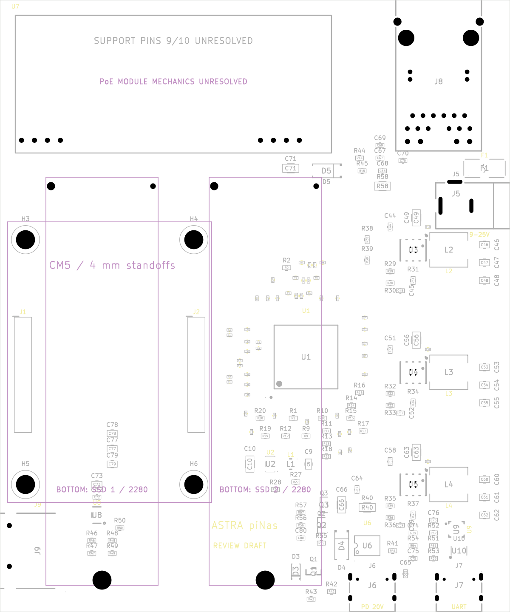
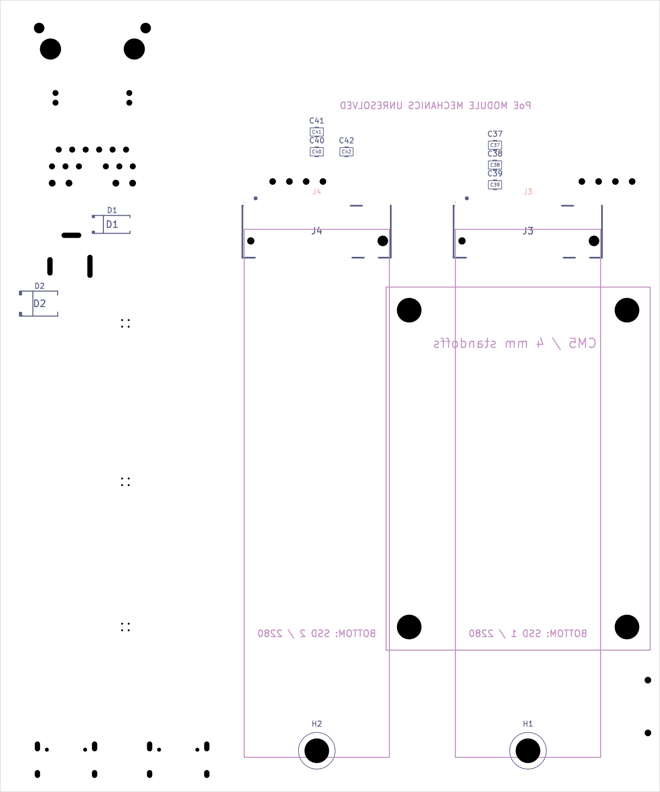
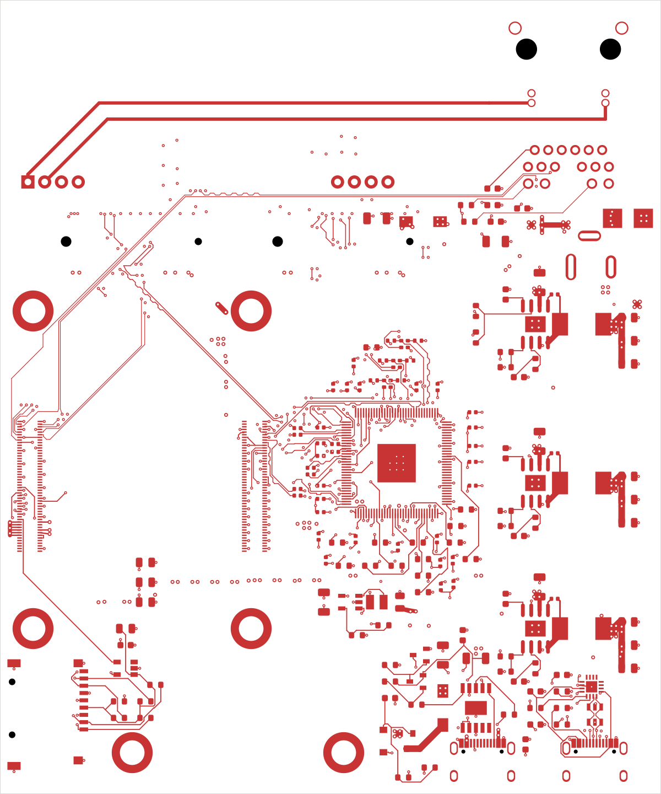
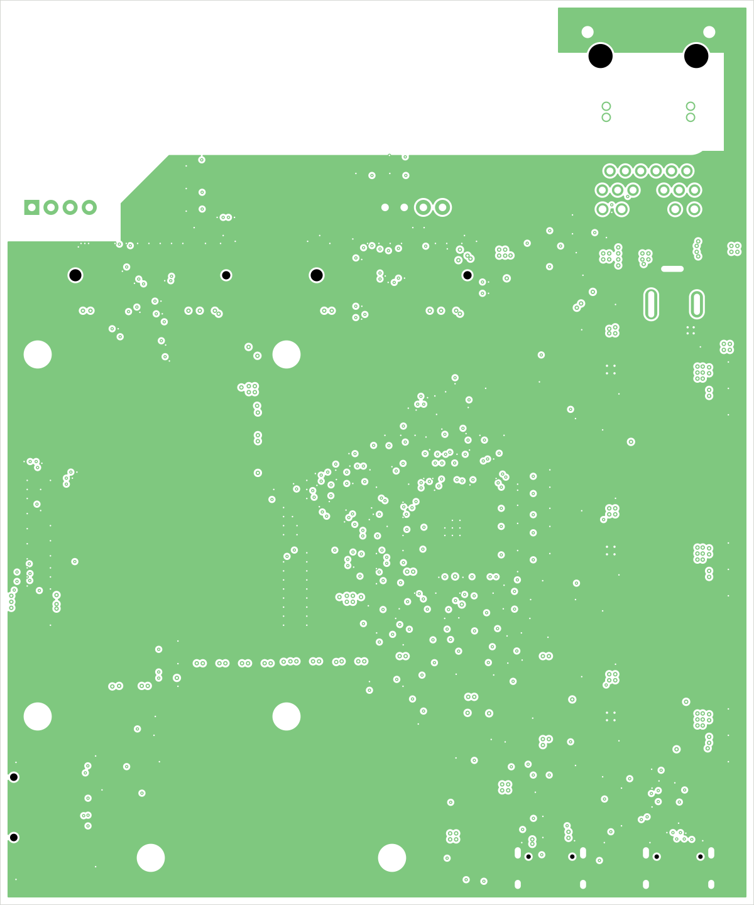
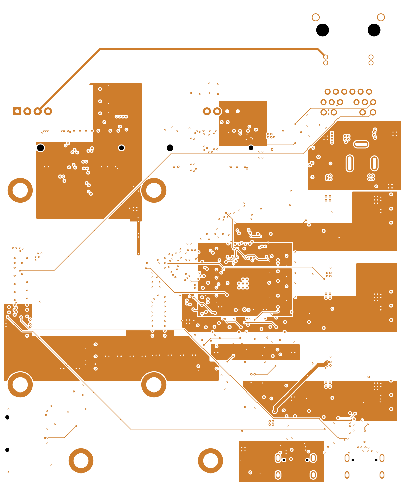
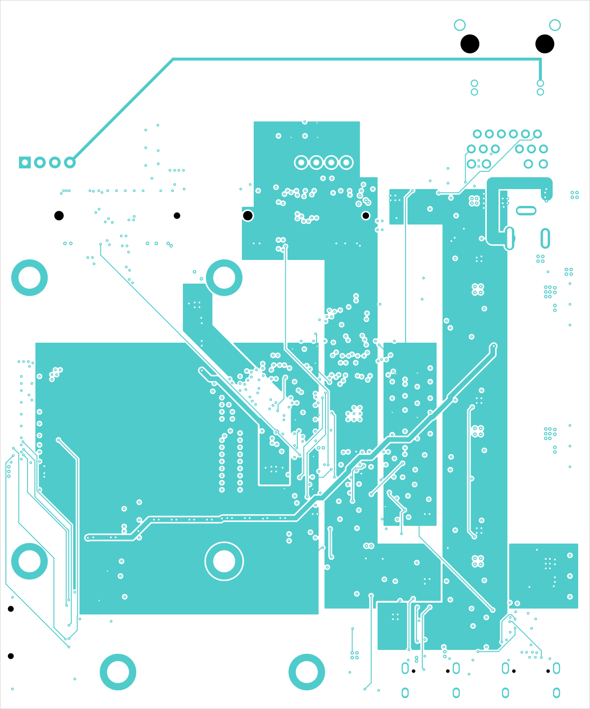
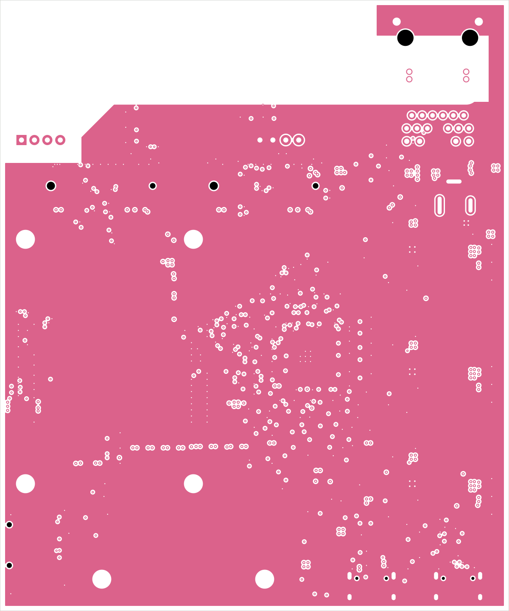
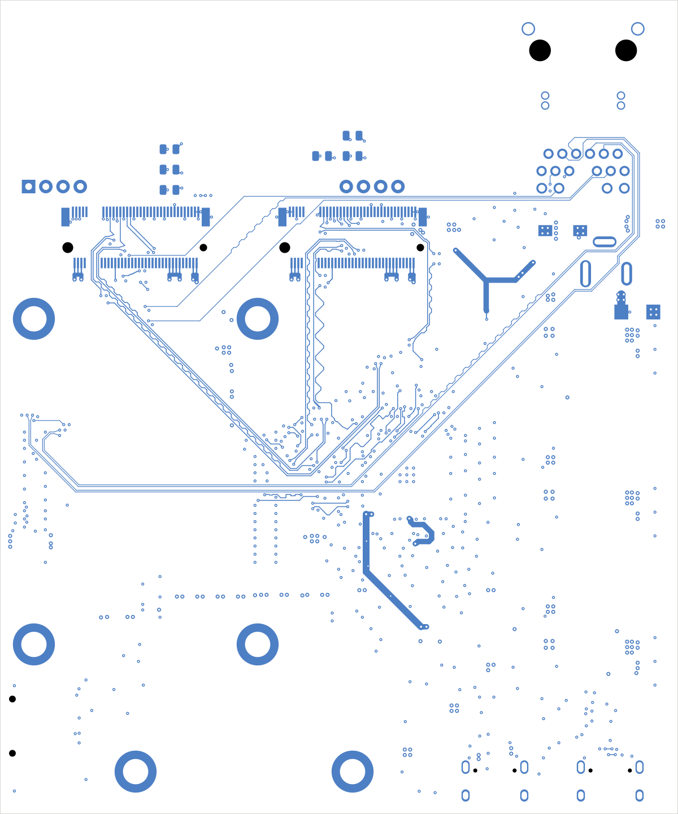
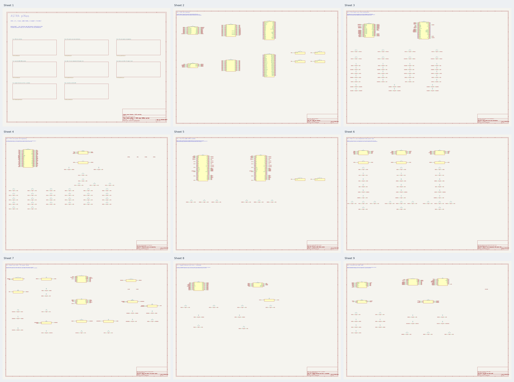

# Astra piNas — CM5 dual NVMe carrier

This project was an experiment in using GPT-6 Astra to create a complete PCB from a single initial prompt, followed by a request to fully route it.

**Initial prompt** *(lightly edited for spelling and grammar)*

> I need a new KiCad project with schematics for a small Raspberry Pi CM5 carrier board. It needs to take two full-size M.2 SSDs, so you will need a PCIe switch. Find parts for everything, along with symbols and footprints.
>
> It also needs one RJ45 Ethernet connector, an SD card slot, a barrel jack that accepts 9–25 V, PoE capability, and a power-only USB-C port. A second USB-C port should be used just for USB-to-UART.
>
> Find good symbols and footprints for everything, and keep it nice. Pay particular attention to the CM5 footprint and make sure it is correct. You have TI_API_KEY, TI_API_SECRET, MOUSER_API_KEY, DIGIKEY_CLIENT_ID and DIGIKEY_CLIENT_SECRET set as environment variables in `~/.local/share/codex`. You also have easyeda2kicad installed. You can use the other APIs for datasheets and create your own footprints too.
>
> Remember to put the footprints and symbols in self-contained project libraries. All parts should be well in stock and have a MANUFACTURER PART NUMBER property. Actually, let's use only in-stock LCSC parts, with 0402 as the minimum component size. Try to minimize the component count and number of passives.
>
> Place things logically on the board afterward so it is easy for me to route. Explicitly: do not look for other work on this computer that might help. It will not help and must not be used. Strictly.

**Routing follow-up** *(lightly edited for spelling and grammar)*

> OK, now fully route it. Feel free to move things around as much as you like; I like the current size. Make it nice and clean, and pick the stackup and everything. Use six layers at most. I think six makes sense here, actually.

Open **[astra_piNas.kicad_pro](astra_piNas.kicad_pro)** in **KiCad 10**. The project contains nine schematic sheets and a fully routed **100 × 120 mm, six-layer** board. Both 2280 NVMe sockets are on the underside. Use a **CM5 Lite** for the native microSD interface.

- [Routing and placement notes](docs/ROUTING.md), [selected stackup](docs/STACKUP.md)
- [Schematic PDF](docs/schematics.pdf)
- [Top copper view](docs/routing_top.svg), [bottom copper view](docs/routing_bottom.svg)
- [Top assembly view](docs/placement_top.svg), [bottom assembly view](docs/placement_bottom.svg)
- [BOM with MPNs and LCSC stock snapshots](docs/BOM.csv), [library provenance](docs/LIBRARIES.md)
- [Final validation summary](docs/routing_validation.json), [pair measurements](docs/pair_lengths.csv)
- [ERC](docs/erc.rpt), [PCB DRC](docs/drc.rpt), [schematic parity](docs/schematic_parity.rpt)

All symbols and footprints resolve through the project-local library tables to `lib/`. Available 3D models use project-relative paths. No unrelated local project was searched or reused; the Raspberry Pi reference files were downloaded from the official archive linked in [library provenance](docs/LIBRARIES.md).

The main project files above are the current design. Local routing experiments, tool caches and the downloaded CM5IO reference archive are excluded from this repository. Final routing measurements and validation reports are included under `docs/`. Regeneration scripts can overwrite manual edits. No fabrication package is released while the PoE hold remains unresolved.

**Board views**

Top and bottom placement views:

| Top | Bottom |
| --- | --- |
|  |  |

All six copper layers, viewed from the top in stackup order. Click a layer name for the full-resolution vector drawing.

| Layer | Copper view |
| --- | --- |
| [L1 · F.Cu — outer routing](docs/images/astra_piNas-F_Cu.svg) |  |
| [L2 · In1.Cu — ground reference](docs/images/astra_piNas-In1_Cu.svg) |  |
| [L3 · In2.Cu — power and slow signals](docs/images/astra_piNas-In2_Cu.svg) |  |
| [L4 · In3.Cu — power and slow signals](docs/images/astra_piNas-In3_Cu.svg) |  |
| [L5 · In4.Cu — ground reference](docs/images/astra_piNas-In4_Cu.svg) |  |
| [L6 · B.Cu — outer routing](docs/images/astra_piNas-B_Cu.svg) |  |

**Schematic overview**

All nine sheets are shown below. Open the [schematic PDF](docs/schematics.pdf) to zoom into individual circuits.

